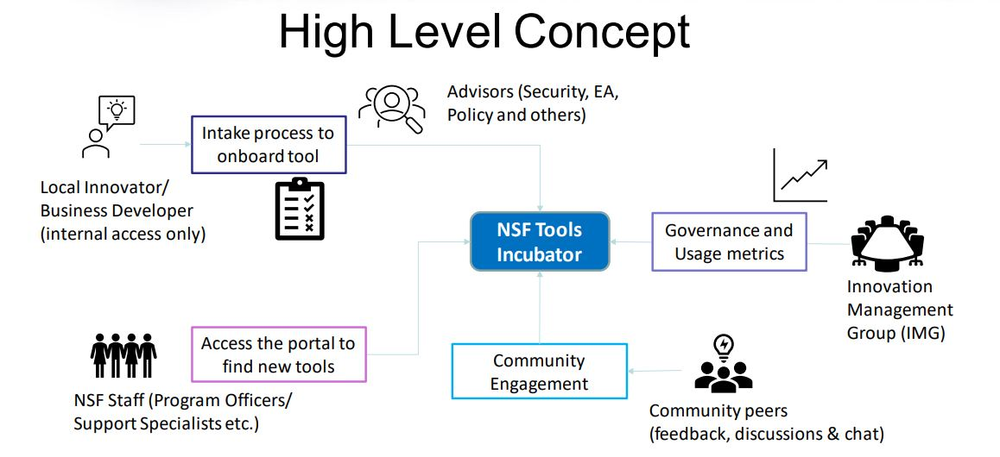

<p align = 'center'>

<p>
<h1 align="center">Hopper - NSF Tools Incubator</h1>
<hr>

## Background


The Hopper Tools Incubator provides a platform to share and nurture local innovations at NSF.

**Objectives:**

- Central portal to share local innovated tools
- Cultivate an ecosystem that collaborate on innovations
- Reduce duplication and break down silos
- Incubate tools and provide a path to maturity

<br>
<p align = 'center'>

<p>

<br>

## In the News
- [How the National Science Foundation is Innovating for its Innovators](https://www.nextgov.com/podcasts/2021/12/critical-update-how-national-science-foundation-innovating-its-innovators/187274/)
- [National Science Foundation CIO: Having Diversity of Thought is Critical](https://www.cdomagazine.tech/cdo_magazine/topics/talent/video-national-science-foundation-cio-having-diversity-of-thought-is-critical/article_92ffceb6-4333-11ed-b2a1-936161ea2391.html)
- [How NSF CIO's Tech Vision Bakes in People, Innovation](https://www.youtube.com/watch?v=tMAUerVvkeA)

## SharePoint Framework Version


- [SharePoint Framework](https://aka.ms/spfx)
- [Microsoft 365 tenant](https://docs.microsoft.com/en-us/sharepoint/dev/spfx/set-up-your-developer-tenant)

## Installation

Build webpart

```javascript 
npm run build prod
```

## Integration
- Microsoft Teams
- Microsoft Sharepoint
- Microsoft Power Automate (Flow)

## References

- [Getting started with SharePoint Framework](https://docs.microsoft.com/en-us/sharepoint/dev/spfx/set-up-your-developer-tenant)
- [Building for Microsoft teams](https://docs.microsoft.com/en-us/sharepoint/dev/spfx/build-for-teams-overview)
- [Use Microsoft Graph in your solution](https://docs.microsoft.com/en-us/sharepoint/dev/spfx/web-parts/get-started/using-microsoft-graph-apis)
- [Publish SharePoint Framework applications to the Marketplace](https://docs.microsoft.com/en-us/sharepoint/dev/spfx/publish-to-marketplace-overview)
- [Microsoft 365 Patterns and Practices](https://aka.ms/m365pnp) - Guidance, tooling, samples and open-source controls for your Microsoft 365 development

## Contribute

Contributions are always welcome! Email us at img@nsf.gov